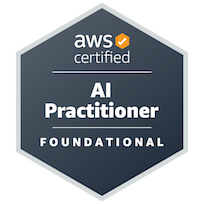

## Hi there 👋

I'm Jhon, a Data Science enthusiast and AWS Certified AI Practitioner, with a solid background in data analysis, statistics, and machine learning. 
I specialize in data cleaning, exploratory data analysis, feature engineering, and model development using Python and pandas, turning complex datasets into actionable insights. 
Additionally, I understand AI/ML fundamentals, responsible AI principles, and cloud-based AI architectures on AWS.

Certified as 
**Data Scientist – DataCamp**.
**AI Practitioner – AWS**
<!--
**Jhon-la/Jhon-la** is a ✨ _special_ ✨ repository because its `README.md` (this file) appears on your GitHub profile.

Here are some ideas to get you started:

- 🔭 I’m currently working on ...
- 🌱 I’m currently learning ...
- 👯 I’m looking to collaborate on ...
- 🤔 I’m looking for help with ...
- 💬 Ask me about ...
- 📫 How to reach me: ...
- 😄 Pronouns: ...
- ⚡ Fun fact: ...
-->
## 🎓 Certifications

**AWS AI Practitioner – AWS** · **Data Scientist – DataCamp** · **Data Scientist Associate – DataCamp**

